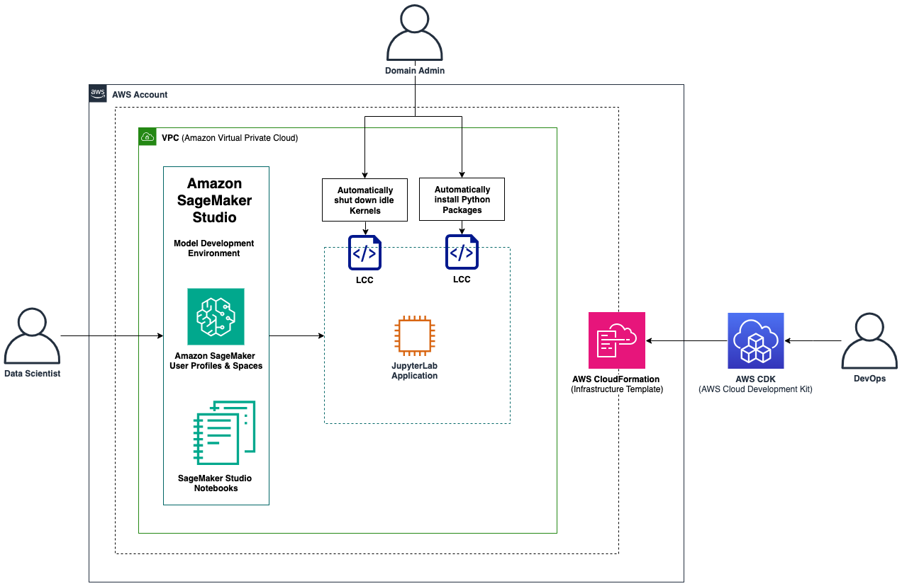

# SageMaker-Studio-LCC-CDK
## Overview
This solution demonstrates how to set up a best-practice Amazon SageMaker Domain with a configurable list of Domain User Profiles and a shared SageMaker Studio Space using AWS Cloud Development Kit (AWS CDK - a framework to for defining cloud infrastructure as code). In addition, it includes two different use-cases of Studio Lifecycle Configurations: 1) Automatic installation of python packages and 2) Automatic shutdown of idle kernels. Both are deployed and managed with AWS CDK Custom Resources. These are powerful, low-abstracted and highly customisable CDK constructs that can be used to manage the behaviour of resources at creation, update or deletion events. We use Python as the main language for our CDK application, but the code can be easily translated to other AWS CDK supported languages.

## Architecture


## Prerequisites 

To get started, make sure you have the following prerequisites:

- The AWS Command Line Interface (AWS CLI) installed
- Node.js and NPM installed
- The AWS CDK installed
- An AWS account with permissions to create AWS Identity and Access Management (AWS IAM) roles, Studio domains, and Studio user profiles
- An account has been bootstrapped for the targeted region as described in section "Commands to run for this deployment”

## Setup your Coding Enviroment
- Download the latest version of Python 3	
- Download Visual Studio Code	
- Clone the Gitlab Repository	
- Setup your virtual environment

```
$ sudo npm install -g aws-cdk@2.95.1
$ sudo conda update -n base -c defaults conda
$ conda create -n cdk-env-sm-studio-lcc python=3.9
$ conda activate cdk-env-sm-studio-lcc
```

## Deploy the CDK Stacks

- Install the required packages	
```
pip install -r requirements.txt
```
- Bootstrap your aws account once before deploying the stack
```
cdk bootstrap aws://<account number>/<region>
```
- Synthesize the CloudFormation template from the CDK code.
```
cdk synth
```
- Check the existing CloudFormation stack and compare the differences with your new version	
```
cdk diff
```
- Deploy the CDK stack.
```
cdk deploy --all -v
```
Destroy the CDK stack whenever you want to clean up the account	
```
cdk destroy --all
```

## Test the 2 SageMaker Studio Lifecycle Configs (LCCs)

### Launch SageMaker Studio	

In the console open up SageMaker. Click on Domains and select studio-domain. Next click on Launch > Studio for your selected user profile and wait until the JupyterServer app has been created.

### Test automatic package installation	
Open a new notebook (File > New > Notebook). Click on Python 3 (DataScience) on the top right corner of the notebook. Select start-up script. In the drop down menu select package-lifecycle-config. Wait until the KernelGatewayApp is created. Try to import the packages which are defined in the lcc script.

```
import pip_install_test

import darts
```

### Test automatic kernel shutdown	
Open a new notebook (File > New > Notebook). Wait until the KernelGatewayApp is created. Close the notebook again. Wait for 2 hours and check if the KernelgatewayApp gets deleted automatically.

Note: You can customize the shutdown period as per your needs even after deployment. Simply overwrite the TIMEOUT_IN_MINS environment variable and run the .auto_shutdown/set-time-interval.sh script from the SageMaker Studio System Terminal. You can also disable automatic shutdown by setting the variable to -1.

## Security

See [CONTRIBUTING](CONTRIBUTING.md#security-issue-notifications) for more information.

## License

This library is licensed under the MIT-0 License. See the LICENSE file.

